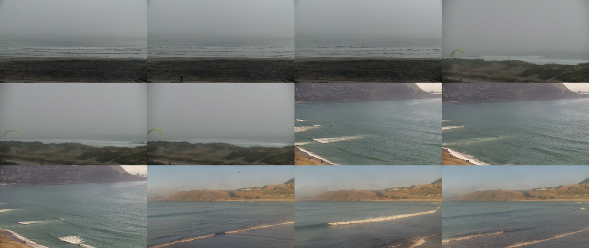

# Will it surf?

A deep-learning model to determine whether it's worth going surfing or not based on a live surf cam feed.

This is mainly an experiment to see if I can learn a model that recognizes my surfing preferences (not too flat, not too closeout, not too windy, etc.). 

# Overview

Surf cam feed (multiple images) -> deep-learning model -> surf condition (good/bad).

Training data from manually annotated images.

# Application

Upload image(s) or point to webcam feed -> output condition category.

# Roadmap

- [ ] Gather training data and hand label (based on my preference)
  * how to preprocess and store images?
  * include other metrics besides images (e.g. wind speed/wave height)?
- [ ] Determine model architecture and loss function
- [ ] Train and monitor performance
- [ ] Create and deploy application

# Future extensions

* Which board to bring (long/short)?
* Which location is best given two options (e.g. Ocean Beach or Pacifica)?
* Dashboard showing plot of predictions over time.